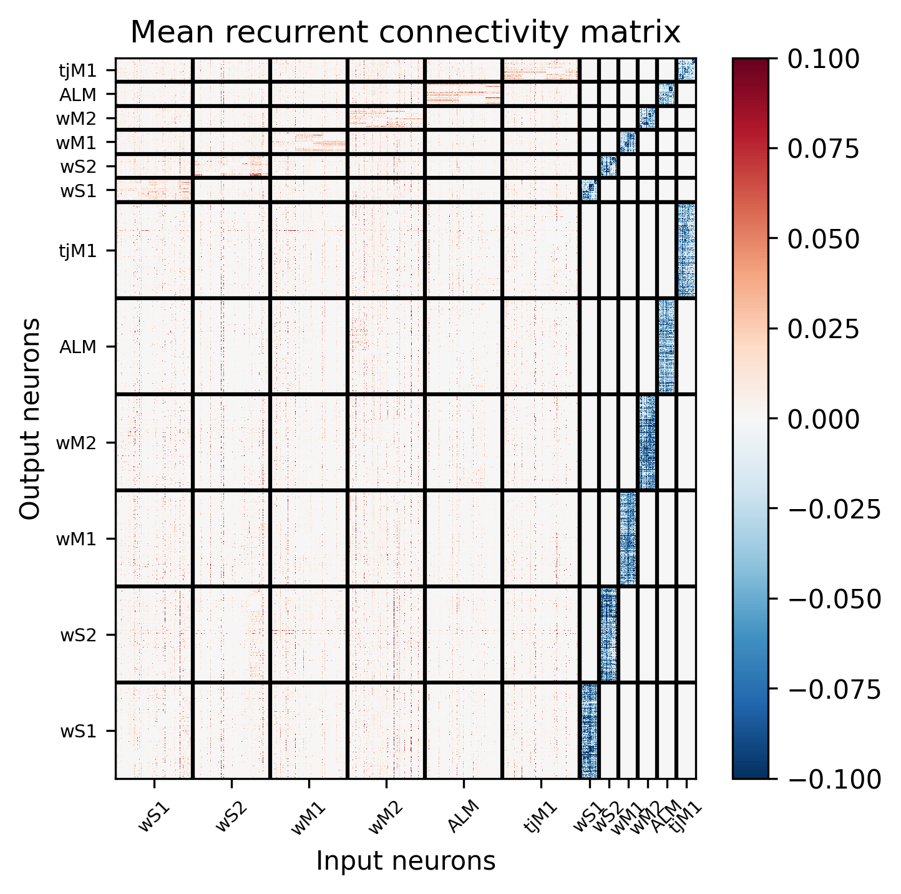
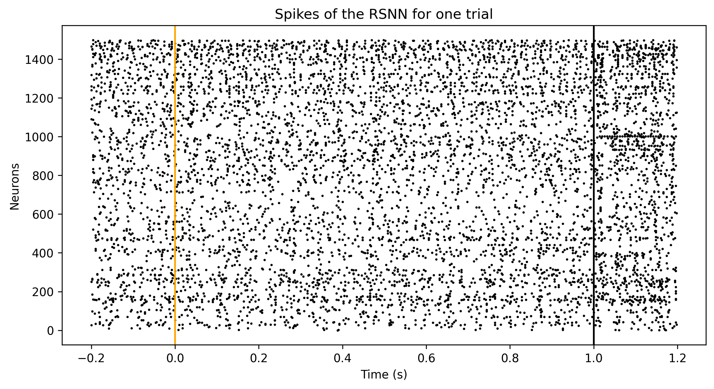

[](https://doi.org/10.5281/zenodo.10006599)

# Trial matching code

This is the code for the publication:
C. Sourmpis, C. Petersen, W. Gerstner & G. Bellec
[*Trial matching: capturing variability with data-constrained spiking neural networks*](https://openreview.net/forum?id=LAbxkhkjbD), accepted at NeurIPS 2023.

Contact:
[christos.sourmpis@epfl.ch](mailto:christos.sourmpis@epfl.ch)


## Glossary
1) [Installation](#Installation)
2) [Generate simpler artificial data](#generate-artificial-data)
3) [QuickStart and load pre-trained models](#quickstart-and-pre-trained-models)
4) [Code snippet for computing the trial-matching loss function](#compute-the-trial-matching-loss-function)
5) [Download recorded data from Esmaeli et al. 2021](#download-recorded-data)
6) [Generate paper figures](#generate-figures-from-a-pre-trained-model)
7) [Training the RSNN](#training-the-rsnn-model)

## Installation
We suggest installing the code with conda and you can do this in the following way:

```bash
conda create --name trial-match python=3.9.5
conda activate trial-match
pip install -e .
```
Now you should be able to run the code.

## Generate Artificial data
For the artificial data just run the command:
```bash
python datasets/pseudodata.py
```
This will generate the data for Figure 2 and the data for some of the supplementary Figures.

## QuickStart and pre-trained models

You can quickly run and explore a trained model in [quick_start.ipynb](quick_start.ipynb).

One can load a pre-trained model as follows.

```python
from infopath.model_loader import load_model_and_optimizer
from infopath.config import load_training_opt

log_path = "log_dir/trained_models/main_model/"
opt = load_training_opt(log_path)
opt.log_path = log_path
opt.device = "cpu"
model = load_model_and_optimizer(opt, reload=True, last_best="last")[0]
```

For instance, the recurrent weights of the model can be obtained with the following:
```python
model.rsnn._w_rec # shape: 2 x 1500 x 1500 (number of delays x output neurons x input neurons)
```
Note: We have two weight matrices, one when the delay is 2 ms and one when the delay is 4 ms.

Here you can see the mean recurrent connectivity:


To simulate a raster of 400 trials from the model one can do:
```python
with torch.no_grad():
    stims = torch.randint(2, size=(10,)) # binary vector of conditions (absence or presence of whisker stimulation)
    spikes, voltages, jaw, state = model(stims) # generation of the input spikes and simulation of the RSNN
```
Here you can see the spiking activity of one simulated trial:


## Compute the trial matching loss-function

Calculate the trial-matching loss with the hard matching (Hungarian Algorithm)

Args:


* pop_avg_data (torch.tensor): $\mathcal{T}_{trial}(z^\mathcal{D})$, with dimension: K x T

* pop_avg_model (torch.tensor): $\mathcal{T}_{trial}(z)$, with dimension K'  x T

```python
def hard_trial_matching_loss(pop_avg_data, pop_avg_model):
    # Subsample the biggest tensor, so both data and model have the same #trials
    min_trials = min(pop_avg_model.shape[0], pop_avg_data.shape[0])
    pop_avg_data = pop_avg_data[:min_trials] # shape: K x T (assuming K = min(K,K'))
    pop_avg_model = pop_avg_model[:min_trials] # shape: K x T
    with torch.no_grad():
        cost = mse_2d(pop_avg_model.T, pop_avg_data.T) # shape: K x K 
        keepx, ytox = linear_sum_assignment(cost.detach().cpu().numpy()) # keepx and ytox are trial indices
    return torch.nn.MSELoss()(pop_avg_model[keepx], pop_avg_data[ytox])
```

The function above is in the `infopath/losses.py` file.

You can explore the loss function in a simple demo in [trial_matching_loss_demo.ipynb](trial_matching_loss_demo.ipynb).

## Download recorded data

In order to use the recorded data you can: 
1. download the spikeData_v9.mat from [here](https://zenodo.org/record/10006599) to the datasets folder 
2. run the following command, while you are in the directory of this project:
```bash
python3 datasets/datastructure2datasetandvideo_Vahid.py
```

or run the following commands, while you are in the directory of this project:

```bash
wget https://zenodo.org/record/10006599/files/spikeData_v9.mat -P datasets
python3 datasets/datastructure2datasetandvideo_Vahid.py
```

## Generate figures from a pre-trained model

The code is sufficient in order to generate all the figures of the paper, in the folder `Figures` one can find the paper figures and notebooks to generate all the panels.

## Training the RSNN model

Training models will require a little bit better understanding of the code. However, you can train a model to fit the pseudodata with the following command, and you can start exploring the parameters, by changing the options in the file configs/pseudodata/opt.json:

```bash
python3 infopath/train.py --config=pseudodata
```
The previous command is supposed to be run on GPU. Be careful that this training will require GPU with RAM of at least 5GB. If you want to run it with CPU, you can change the field "device" in the configs/pseudodata/opt.json.

### Notes
1. For Figures 3-4 you might notice that that they are not identical to the ones in the paper, this happens because we changed the function that generates the input spikes for readability. However, you can appreciate that the message of the main paper remains the same.
2. When we tried to reproduce Figure 4C in a different OS (our default is Ubuntu), we observed very minor differences in the position of the clusters (the clusters are qualitatively the same). This can lead to the boxes not being in the correct location and Figure 4D is not plotted correctly (you might need to modify the box location). 

### Citation 
You can cite us with the following bibtex:
```latex
@article{
    sourmpis2023trialmatching,
    title     = {Trial matching: capturing variability with data-constrained spiking neural networks},
    author    = {Sourmpis, Christos and Petersen, Carl C H and Gerstner, Wulfram and Bellec, Guillaume},
    journal   = {Thirty-seventh Conference on Neural Information Processing Systems},
    year      = {2023}
}
```
and here is the citation for the data:
```latex
@article{
    esmaeili2021rapid,
    title     = {Rapid suppression and sustained activation of distinct cortical regions for a delayed sensory-triggered motor response},
    author    = {Esmaeili, Vahid and Tamura, Keita and Muscinelli, Samuel P and Modirshanechi, Alireza and Boscaglia, Marta and Lee, Ashley B and Oryshchuk, Anastasiia and Foustoukos, Georgios and Liu, Yanqi and Crochet, Sylvain and Petersen, Carl C.H.},
    journal   = {Neuron},
    year      = {2021},
    volume    = {109},
    number    = {13},
    pages     = {2183--2201},
    doi       = {https://doi.org/10.1016/j.neuron.2021.05.005}
}
```
